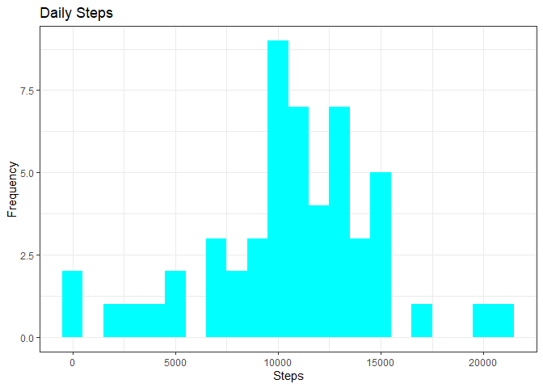
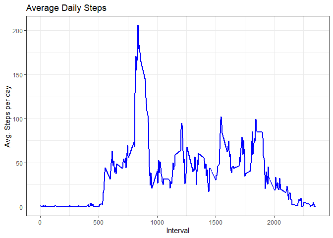
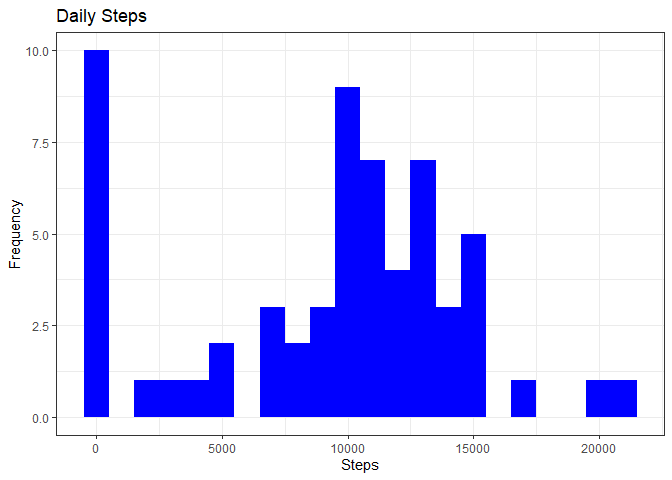
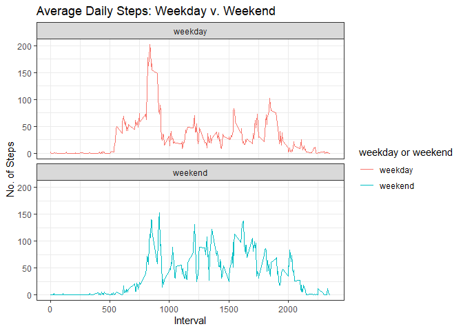

### Introduction

It is now possible to collect a large amount of data about personal movement using activity monitoring devices such as a Fitbit, Nike Fuelband, or Jawbone Up. These type of devices are part of the “quantified self” movement – a group of enthusiasts who take measurements about themselves regularly to improve their health, to find patterns in their behavior, or because they are tech geeks. But these data remain under-utilized both because the raw data are hard to obtain and there is a lack of statistical methods and software for processing and interpreting the data.

This assignment makes use of data from a personal activity monitoring device. This device collects data at 5 minute intervals through out the day. The data consists of two months of data from an anonymous individual collected during the months of October and November, 2012 and include the number of steps taken in 5 minute intervals each day.

The data for this assignment can be downloaded from the course web site:

 - Dataset: [Activity monitoring data](https://d396qusza40orc.cloudfront.net/repdata%2Fdata%2Factivity.zip) [52K]

The variables included in this dataset are:

 - **steps**: Number of steps taking in a 5-minute interval (missing values are coded as NA). 
 - **date**: The date on which the measurement was taken in YYYY-MM-DD format
 - **interval**: Identifier for the 5-minute interval in which measurement was taken

The dataset is stored in a comma-separated-value (CSV) file and there are a total of 17,568 observations in this dataset.


### 1. Loading and preprocessing the data
#### Load the data

``` r
library("data.table")
```

```
## Warning: package 'data.table' was built under R version 4.4.3
```

``` r
library(ggplot2)
```

```
## Warning: package 'ggplot2' was built under R version 4.4.3
```

``` r
fileUrl <- "https://d396qusza40orc.cloudfront.net/repdata%2Fdata%2Factivity.zip"
download.file(fileUrl, destfile = paste0(getwd(), '/repdata%2Fdata%2Factivity.zip'), method = "curl")
unzip("repdata%2Fdata%2Factivity.zip",exdir = "data")
```

#### Read csv data into data.table

``` r
activityDT <- data.table::fread(input = "data/activity.csv")
```


``` r
summary(activityDT)
```

```
##      steps             date               interval     
##  Min.   :  0.00   Min.   :2012-10-01   Min.   :   0.0  
##  1st Qu.:  0.00   1st Qu.:2012-10-16   1st Qu.: 588.8  
##  Median :  0.00   Median :2012-10-31   Median :1177.5  
##  Mean   : 37.38   Mean   :2012-10-31   Mean   :1177.5  
##  3rd Qu.: 12.00   3rd Qu.:2012-11-15   3rd Qu.:1766.2  
##  Max.   :806.00   Max.   :2012-11-30   Max.   :2355.0  
##  NA's   :2304
```


### 2. What is mean total number of steps taken per day?
#### Calculate the total number of steps taken per day.

``` r
Total_Steps <- activityDT[, c(lapply(.SD, sum, na.rm = FALSE)), 
                          .SDcols = c("steps"), by = .(date)] 

head(Total_Steps, 10)
```

```
##           date steps
##         <IDat> <int>
##  1: 2012-10-01    NA
##  2: 2012-10-02   126
##  3: 2012-10-03 11352
##  4: 2012-10-04 12116
##  5: 2012-10-05 13294
##  6: 2012-10-06 15420
##  7: 2012-10-07 11015
##  8: 2012-10-08    NA
##  9: 2012-10-09 12811
## 10: 2012-10-10  9900
```

#### Make a histogram of the total number of steps taken each day.

``` r
ggplot(Total_Steps, aes(x = steps)) +
        geom_histogram(fill = "cyan", 
                       binwidth = 1000) +
        labs(title = "Daily Steps",
             x = "Steps",
             y = "Frequency") +
        theme_bw()
```

```
## Warning: Removed 8 rows containing non-finite outside the scale range
## (`stat_bin()`).
```

<!-- -->

#### Calculate and report the mean and median of the total number of steps taken each day.

``` r
Total_Steps[, .(Mean_Steps = mean(steps, na.rm = TRUE), 
                Median_Steps = median(steps, na.rm = TRUE))]
```

```
##    Mean_Steps Median_Steps
##         <num>        <int>
## 1:   10766.19        10765
```

 - The **mean** total number of steps taken each days is 10,766.19
 - The **median** total number of steps taken each day is 10,765.


### 3. What is the average daily activity pattern?
#### Make a time series plot (i.e. 𝚝𝚢𝚙𝚎 = "𝚕") of the 5-minute interval (x-axis) and the average number of steps taken, averaged across all days (y-axis)

``` r
IntervalDT <- activityDT[, c(lapply(.SD, mean, na.rm = TRUE)), 
                         .SDcols = c("steps"), by = .(interval)] 

ggplot(IntervalDT, aes(x = interval , y = steps)) + 
        geom_line(color="blue", size=1) + 
        labs(title = "Average Daily Steps", 
             x = "Interval", y = "Avg. Steps per day") +
        theme_bw()
```

```
## Warning: Using `size` aesthetic for lines was deprecated in ggplot2 3.4.0.
## ℹ Please use `linewidth` instead.
## This warning is displayed once every 8 hours.
## Call `lifecycle::last_lifecycle_warnings()` to see where this warning was
## generated.
```

<!-- -->

#### Which 5-minute interval, on average across all the days in the dataset, contains the maximum number of steps?

``` r
IntervalDT[steps == max(steps), .(max_interval = interval)]
```

```
##    max_interval
##           <int>
## 1:          835
```

 - It is the **835th** interval


### 4. Imputing missing values
#### Calculate and report the total number of missing values in the dataset (i.e. the total number of rows with 𝙽𝙰s)

``` r
activityDT[is.na(steps), .N ]
```

```
## [1] 2304
```

``` r
nrow(activityDT[is.na(steps),])
```

```
## [1] 2304
```

 - There are 2,304 rows missing.

#### Devise a strategy for filling in all of the missing values in the dataset. The strategy does not need to be sophisticated. For example, you could use the mean/median for that day, or the mean for that 5-minute interval, etc.

``` r
# using the median for missing values 
activityDT[is.na(steps), "steps"] <- activityDT[, c(lapply(.SD, median, na.rm = TRUE)), .SDcols = c("steps")]
```

#### Create a new dataset that is equal to the original dataset but with the missing data filled in.

``` r
data.table::fwrite(x = activityDT, file = "data/tidyData.csv", quote = FALSE)
```

#### Make a histogram of the total number of steps taken each day and calculate and report the mean and median total number of steps taken per day. Do these values differ from the estimates from the first part of the assignment? What is the impact of imputing missing data on the estimates of the total daily number of steps?


``` r
Total_Steps <- activityDT[, c(lapply(.SD, sum)), .SDcols = c("steps"), by = .(date)] # total num of steps/day

Total_Steps[, .(Mean_Steps = mean(steps), Median_Steps = median(steps))]   # mean and median num of steps/day
```

```
##    Mean_Steps Median_Steps
##         <num>        <int>
## 1:    9354.23        10395
```

``` r
ggplot(Total_Steps, aes(x = steps)) + 
        geom_histogram(fill = "blue", binwidth = 1000) + 
        labs(title = "Daily Steps",
             x = "Steps", 
             y = "Frequency") +
        theme_bw()
```

<!-- -->

Type of Estimate | Mean_Steps | Median_Steps
---------------- | -------- | ---------
First Part (with NA) | 10765 | 10765
Second Part (used median with NAs) | 9354.23 | 10395

### 5. Are there differences in activity patterns between weekdays and weekends?
#### Create a new factor variable in the dataset with two levels – “weekday” and “weekend” indicating whether a given date is a weekday or weekend day.

``` r
activityDT <- data.table::fread(input = "data/activity.csv")
activityDT[, date := as.POSIXct(date, format = "%Y-%m-%d")]
activityDT[, `Day of Week`:= weekdays(x = date)]
activityDT[grepl(pattern = "Monday|Tuesday|Wednesday|Thursday|Friday", 
                 x = `Day of Week`), "weekday or weekend"] <- "weekday"
activityDT[grepl(pattern = "Saturday|Sunday", 
                 x = `Day of Week`), "weekday or weekend"] <- "weekend"
activityDT[, `weekday or weekend` := as.factor(`weekday or weekend`)]
head(activityDT, 10)
```

```
##     steps       date interval Day of Week weekday or weekend
##     <int>     <POSc>    <int>      <char>             <fctr>
##  1:    NA 2012-10-01        0      Monday            weekday
##  2:    NA 2012-10-01        5      Monday            weekday
##  3:    NA 2012-10-01       10      Monday            weekday
##  4:    NA 2012-10-01       15      Monday            weekday
##  5:    NA 2012-10-01       20      Monday            weekday
##  6:    NA 2012-10-01       25      Monday            weekday
##  7:    NA 2012-10-01       30      Monday            weekday
##  8:    NA 2012-10-01       35      Monday            weekday
##  9:    NA 2012-10-01       40      Monday            weekday
## 10:    NA 2012-10-01       45      Monday            weekday
```

#### Make a panel plot containing a time series plot (i.e. 𝚝𝚢𝚙𝚎 = "𝚕") of the 5-minute interval (x-axis) and the average number of steps taken, averaged across all weekday days or weekend days (y-axis). See the README file in the GitHub repository to see an example of what this plot should look like using simulated data.

``` r
activityDT[is.na(steps), "steps"] <- activityDT[, c(lapply(.SD, median, na.rm = TRUE)), .SDcols = c("steps")]
IntervalDT <- activityDT[, c(lapply(.SD, mean, na.rm = TRUE)), .SDcols = c("steps"), by = .(interval, `weekday or weekend`)] 

ggplot(IntervalDT , aes(x = interval , 
                        y = steps, color=`weekday or weekend`)) + 
        geom_line() + 
        labs(title = "Average Daily Steps: Weekday v. Weekend", 
             x = "Interval", y = "No. of Steps") + 
        facet_wrap(~`weekday or weekend` , ncol = 1, nrow = 2) +
        theme_bw()
```

<!-- -->


